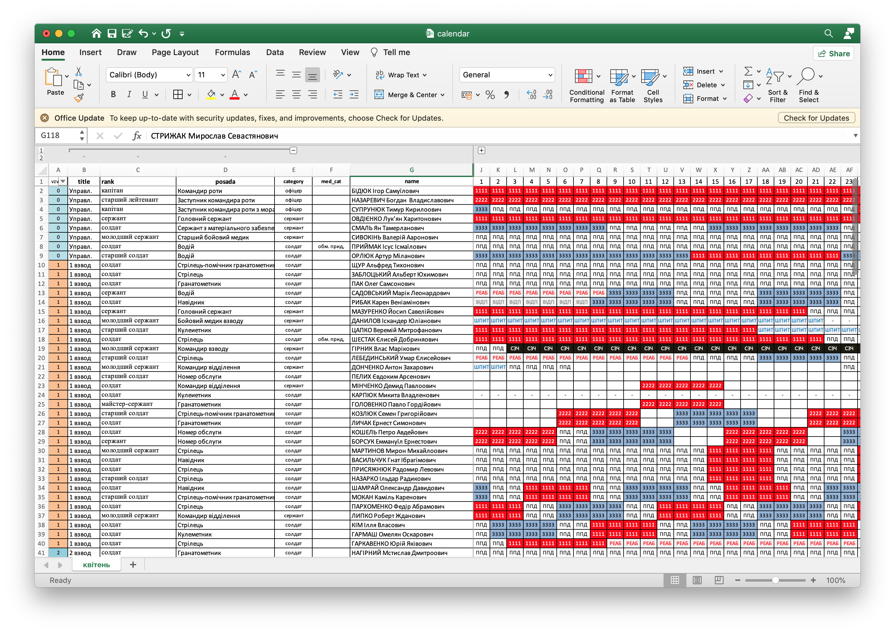
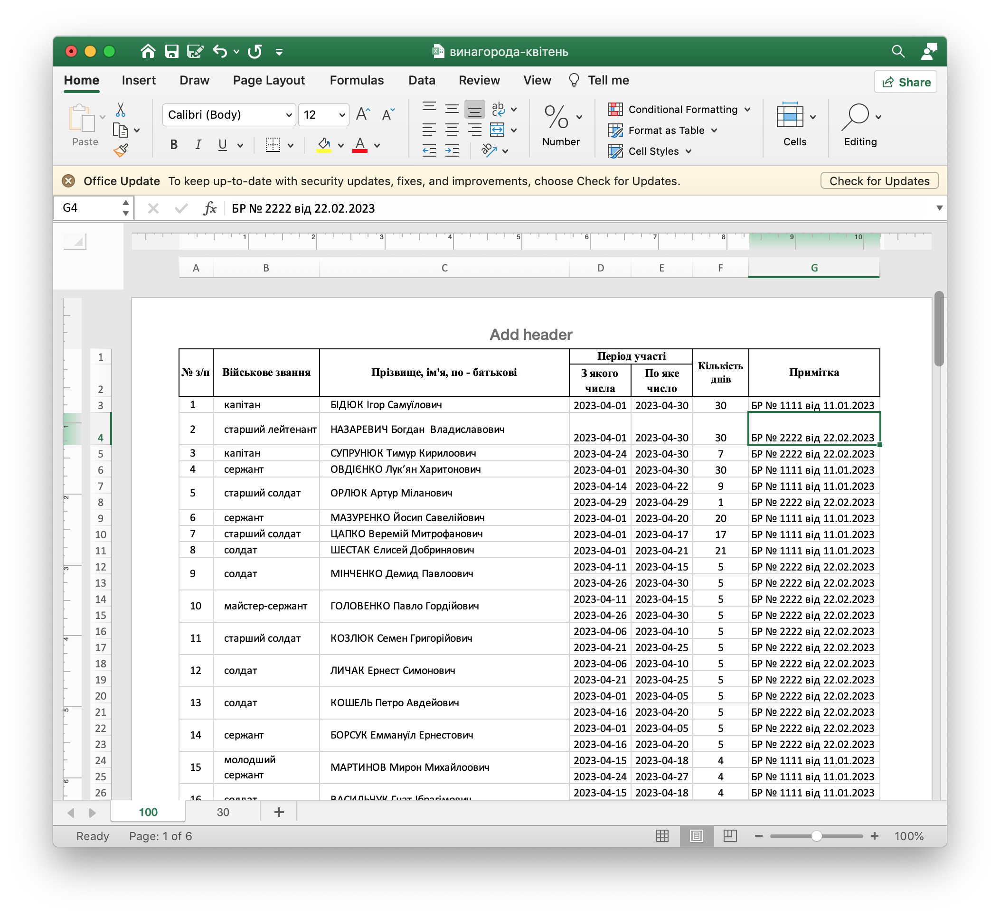

### Додаткова Винагорода для особового складу ЗСУ/НГУ/ССО/ТРО

Нещодавно прийнято закон (чи то постанова КМУ була), що змінює порядок оплати для вийськово службовців, це вже не секрет майже ні для кого. В кінці кожного місяця вийськові формування різних рівнів передають у свої стройові служби рапорти на додаткову винагороду особового складу у відповідності до БР (бойових ропоряджень) які цей особовий склад виконував. В залежності від кількості ос, типів БРок, банальне заповнення таблички може бути доволі ресурсоємкою, нудною та часто помилковою роботою.

Так сталось, що я переглянув десь 20 таких звітів нашої бригади - и вирішив полегшити роботу канцеляристам чи вийськовослужбовцям, що змушені в кінці місяця перетворюватись в кишенькові калькулятори рахуючи різницю в датах та розносячи дані по різним таблицям у Екселі. Хочете витрати на заповнення такої таблиці максимум 2 хвилини в кінці місяця? Читайте далі!

## Що нам знадобиться?

- Excel / Google Sheets (та базове вміння його використовувать)
- Jupyter Notebook 

### Jupyter Notebook

Вам потрібно буде встановити Jupyter Notebook на компютер. Перед використанням Jupyter Notebook потрібно буде встановити Python, щоб не заморочуватись ми встановимо дистрибутив [Anaconda](https://www.anaconda.com/download/) яка вже встановить як Python, так і Jupyter Notebook.

Завантажте інсталятор [Anaconda](https://www.anaconda.com/download/) для своєї платформи і запустить программу інсталяції. Під час інсталяції вкажіть параметер для того щоб Anaconda була додана в змінну `PATH`. 

Далі у вкладкі `Home` / `Главная` / `Головна` просто запустіть `JupyterLab` або `Jupyter Notebook`. Саме з цієї программми ми будемо генерувати дані для нашого рапорту.

### `calendar.xlsx` для цедення обліку особового складу

Для генерації детального рапорту нам знадобиться звідкись брати дані, я створив приклад зповнення невеличкого файлу (див `calendar.xlsx`) - суть якого проста: **для кожного з особового складу ми у колонці дня прописуємо певний статус або номер БР на якій він знаходиться**. Генератор вибиратиме номера БРок та формуватиме дані для рапорту. Статуси можна пропустити - але якщо ви їх будете проставляти то відразу зможете генерувати якийсь список БЧС або щоденне зведення по особовому складу.



Крім того у складених колонках (ті що за плюсом) ховаються деякі дані які можуть вам знадобитись у щоденному жітті військвого канцеляриста. 

### Покрокова інстуркція

- відкрийте у `Jupyter Notebook` / `Jupyter Lab` папку з цим проектом.
- внесить дані у `calendar.xlsx` (або вносьте їх на протязі місяця)
- у `jupyter notebook` внесіть зміни у потрібні комірки (назва ексельки, назва листку, кількість днів та формат дати)
- зробіть записи щодо БР та як їх розрізняти
- надисніть в меню `Kernel` пункт `Restart Kernel and Run All Cells...`
- зачекайте 
- у папці з проектом знайдіть свій файл (`винагорода-{імя}.xlsx`) 
- дані за допомогою копіпасти вставте в свій рапорт в `таблицю 1` або `таблицю 2`
- відформатуйте за своїми вподобаннями
- роздрукуйте здайте до стройової, передайте в персонал та чекайте грошей в другій половині місяця.



### До Побратимів по зброї

Для потреб на нашій ділянкі фронту нам потрібен висотний дрон (вибір пав на [DJI Matrice M30T](https://www.dji.com/matrice-30)) але коштів на нього наразі недостатньо, я буду радий якщо ви долучитесь до збору хоча б дуже дуже частково (свої бойові за останій місяць я витратив на дронобойку для позиції за якою ми закріплені, допомогу сімям наших полеглих побратимів), я реально сам не витягну:

- Монобанка https://send.monobank.ua/jar/2VPBMTWDoV
- Картка `5375 4112 0403 4396`
- PayPal: `obutuzov@gmail.com`

### Допомога & Скачати

- Signal - https://signal.group/#CjQKIEHIlmlaRkqy-PZGQEU-YB2oVs_R4fX3g0HVKr7bu1XiEhBVHvoCrTsY4Ei8OYXNNASZ
- Скачати проект - https://github.com/butuzov/vynagoroda-zsu/archive/refs/heads/main.zip


```python

```
